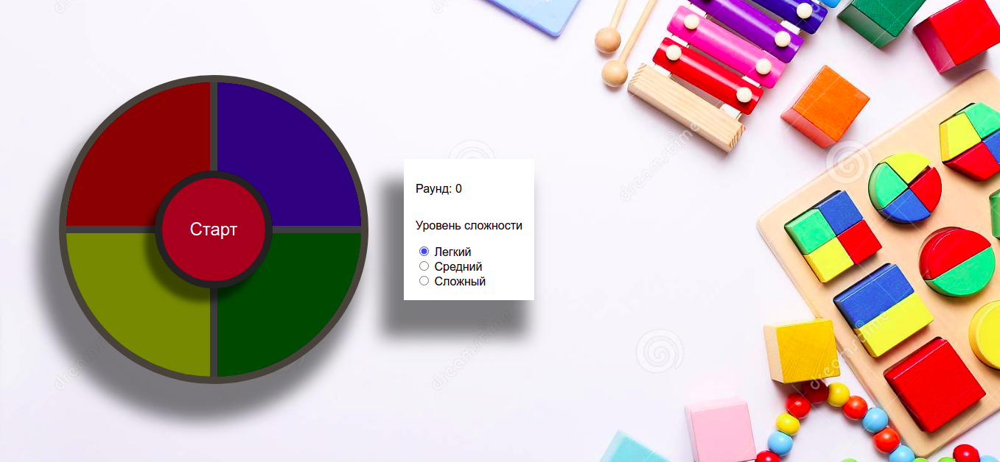
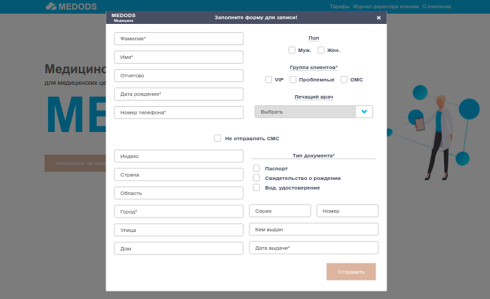
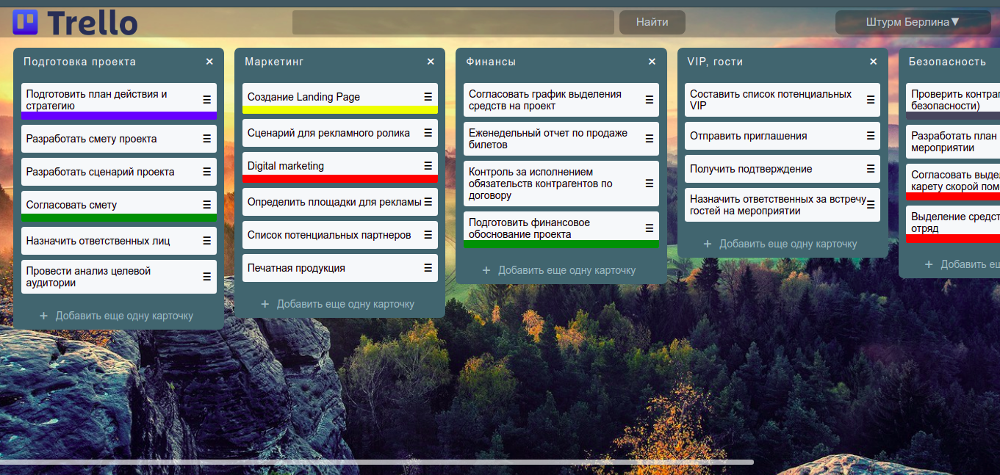
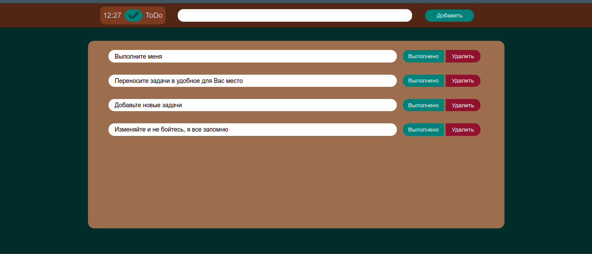

## Портфолио
---
### Simon the game
##### Используемые технологии:
- Vue.js
- Sass

- [GitHub](https://github.com/RKolbnev/simon_the_game)
- [Firebase](https://simon-53ab4.web.app/)
***
### Форма создания клиента.
##### Используемые технологии:
- Vue.js
- Sass

- [GitHub](https://github.com/RKolbnev/medods_test)
- [Firebase](https://form-802dc.web.app/)
***

### Simple Trello
#### Данный проект является упрощенной версией известной системы управления проектами Trello.
##### Используемые технологии:
- JS
- Sass

- [GitHub](https://github.com/RKolbnev/simple_Trello)
- [Firebase](https://simpletrello-88eaf.web.app/)
***
### ToDo
#### Простой вариант системы котроля задач
##### Используемые технологии:
- JS
- Sass

- [GitHub](https://github.com/RKolbnev/ToDo_JS)
- [Firebase](https://todo-59b4a.web.app/)
