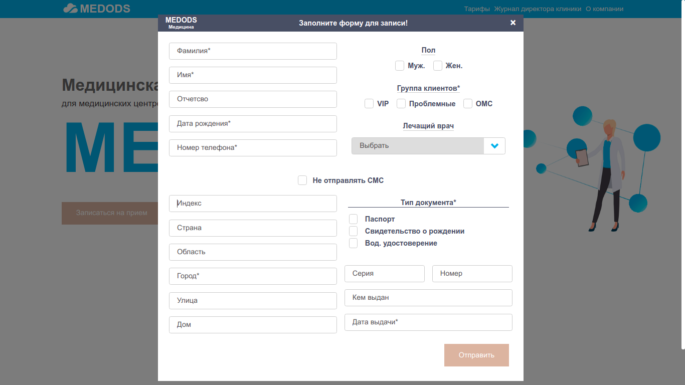

## Портфолио
---
### Simon the game
##### Используемые технологии:
- Vue 3
- Sass

- [GitHub](https://github.com/RKolbnev/simon_the_game)
- [Firebase](https://simon-53ab4.web.app/)
***
### Форма создания клиента.
##### Используемые технологии:
- Vue 3
- Sass

- [GitHub](https://github.com/RKolbnev/medods_test)
- [Firebase](https://form-802dc.web.app/)
***

### Simple Trello
#### Данный проект является упрощенной версией известной системы управления проектами Trello.
##### Используемые технологии:
- JavaScript
- Sass
- Firebase

- [GitHub](https://github.com/RKolbnev/simple_Trello)
- [Firebase](https://simpletrello-88eaf.web.app/)
***

### Todo
#### Простой вариант системы котроля задач
##### Используемые технологии:
- Vue 3
- Sass
- Firebase

- [GitHub](https://github.com/RKolbnev/todo_vue)
- [Firebase](https://todo-vue-e2829.web.app/)
***
